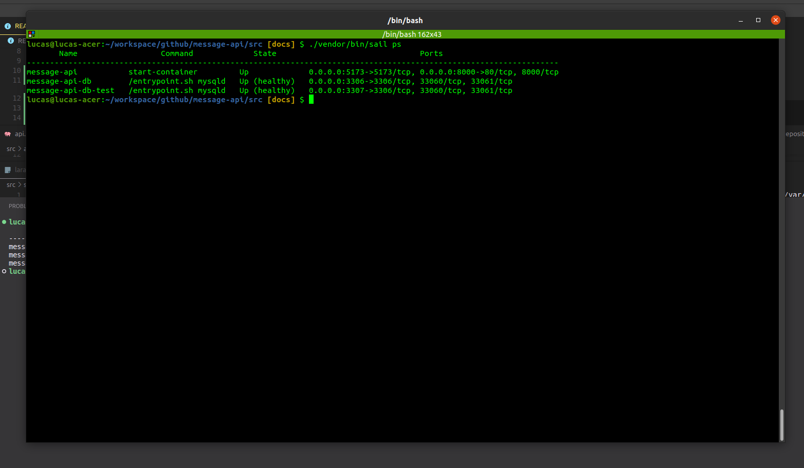
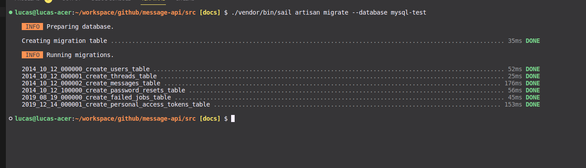
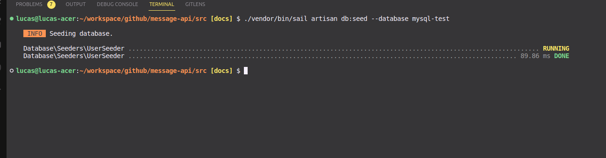
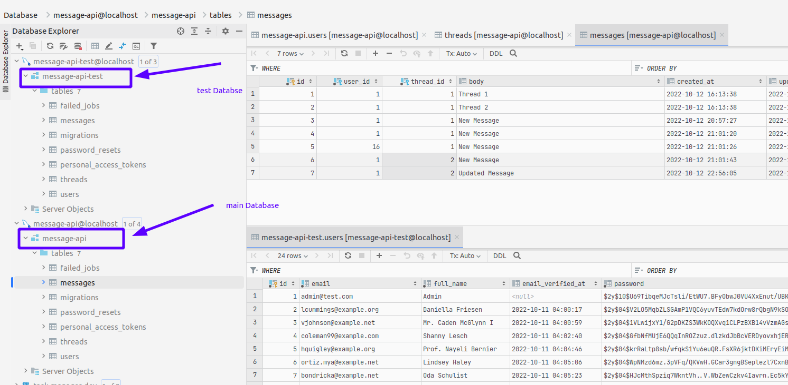
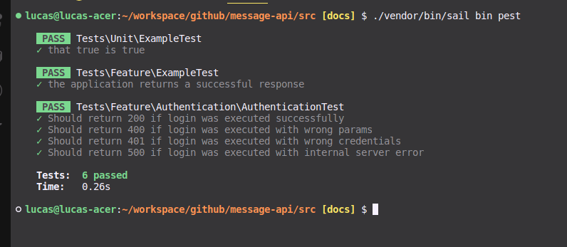

# Message API #

This is an API Rest developed with Laravel, PHP and Clean Architecture.

* Laravel version: 9.34
* PHP version: 8.1
* Database: Mysql
* Tests made with Pest
* Containers with Sail

### How do I get set up? ###

* .env
  
  Rename or copy the .env.example to .env

        cp .env.example .env

  The .env is configured to use docker database setup

* build app

    In the app root (the same dir where is located the package.json and this README) run:

        cd src
        ./vendor/bin/sail up -d --build

    To watch sail (docker) live logging:

        ./vendor/bin/sail logs -f
    
    To check sail containers:

        ./vendor/bin/sail ps
    
    You should see the following containers active:

    

### Database Setup ###

Before start to test the application you should run the migrations and seeder to setup the development database and the test database as well to run the feature tests

* Running migration for development 
        
        ./vendor/bin/sail artisan migrate

* Running migration for test

        ./vendor/bin/sail artisan migrate --database mysql-test

* The migrations result:
  
    

* Running seeders for development 
        
        ./vendor/bin/sail artisan db:seed

* Running seeders for test

        ./vendor/bin/sail artisan db:seed --database mysql-test

* The seeders result:
  
    

* The database result:
  
    

### How to run unit tests? ###

* Normal test  
        
        ./vendor/bin/sail bin pest

    

* Postman Project

    See [Postman Collection](./docs/collection.json)
  
### Who do I talk to? ###

* Lucas Sahdo - lucassahdo@gmail.com